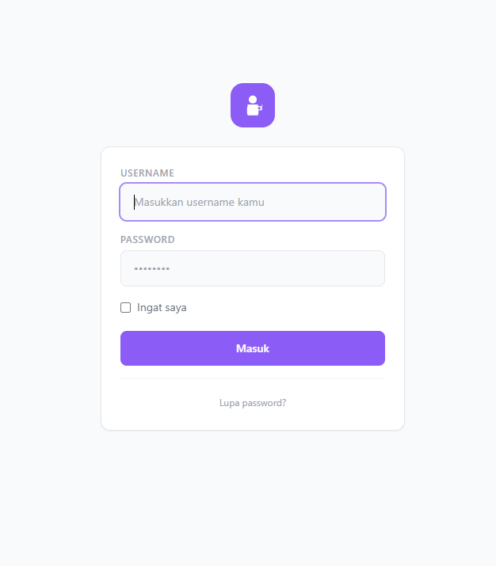
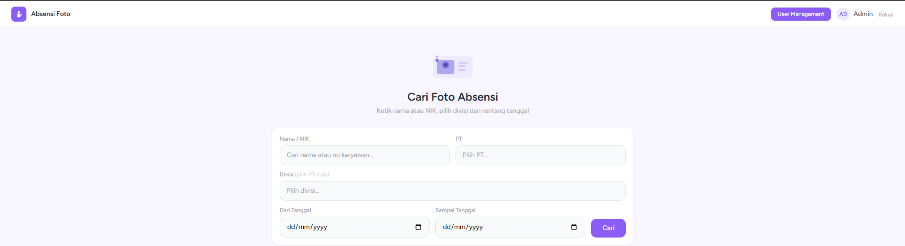
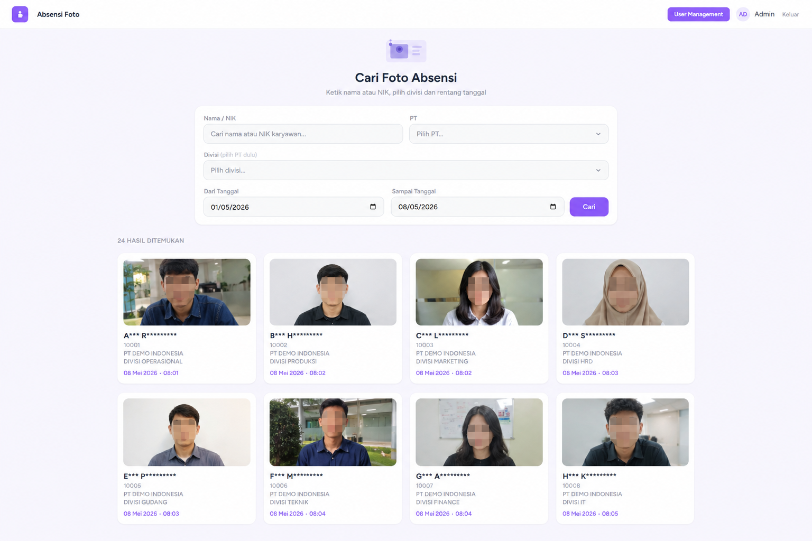
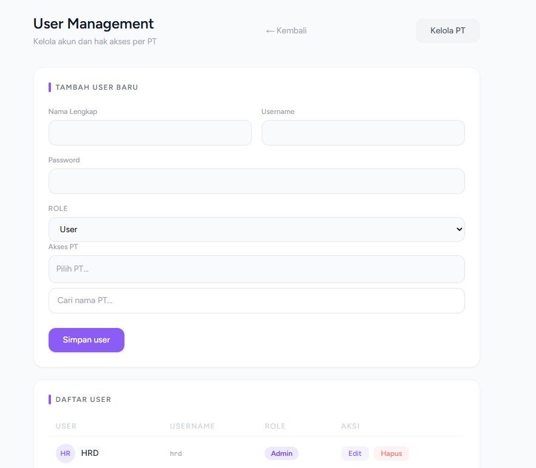

# HR Attendance Monitoring Dashboard

A web-based attendance monitoring system built with Laravel to help HR teams manage and verify employee attendance efficiently.

## Features

* Secure Login Authentication
* Multi Company / PT Access Management
* Employee Attendance Photo Monitoring
* Attendance Search & Filtering
* Real-time Dashboard
* External Storage Integration
* HR Operational Monitoring
* Responsive Admin Panel

## Technologies Used

* Laravel
* PHP
* MySQL / PostgreSQL
* Bootstrap
* JavaScript
* External Storage Integration

## Screenshots

### Login Page



### Dashboard



### Search



### User Management



## Purpose

This project was created to simplify HR operational workflows by centralizing attendance photo verification and monitoring processes.

## Installation

```bash
composer install
cp .env.example .env
php artisan key:generate
php artisan serve
```

## License

This project is for portfolio and educational purposes.
